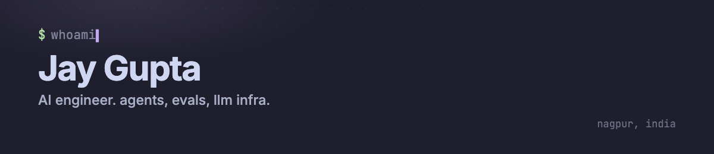

<p>
  
</p>

### // now

- `encraft` video-analysis and retrieval pipelines for enterprise compliance
- `oss` agent tooling around [openchamber](https://github.com/openchamber/openchamber) and [ai-python](https://github.com/vercel-labs/ai-python)
- `prev` prepairo: GRE AI tutor, daily ETL pipeline (3× app downloads, 60% DAU growth)

### // work

- `sketchpen` whiteboard-video engine built from scratch. script in, animated explainer out. [sketchpen.app](https://sketchpen.app)
- `apex` desktop AI workspace. type-safe agents over MCP, Rust filesystem service. private for now.

### // open source

- [openchamber #2796](https://github.com/openchamber/openchamber/pull/2796) `/btw`: side questions in a temporary forked session
- [openchamber #2767](https://github.com/openchamber/openchamber/pull/2767) nested git repositories across the git surfaces
- [ai-python #260](https://github.com/vercel-labs/ai-python/pull/260) and [#259](https://github.com/vercel-labs/ai-python/pull/259) media-type detection and stream-finish fixes

### // stack

```console
$ cat stack.txt
languages  python · typescript · rust (basics) · sql
ai         agents · rag · evals · tts · ocr
backend    fastapi · postgres · docker · aws · gcp
```

### // elsewhere

[site](https://jaygupta17.github.io) · [x](https://x.com/guptajay19) · [linkedin](https://linkedin.com/in/jaygupta17) · [email](mailto:jayajaygupta16@gmail.com)
